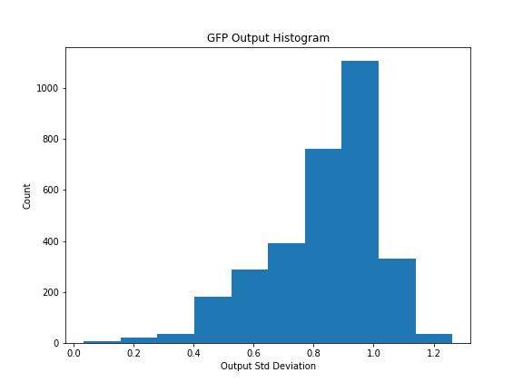
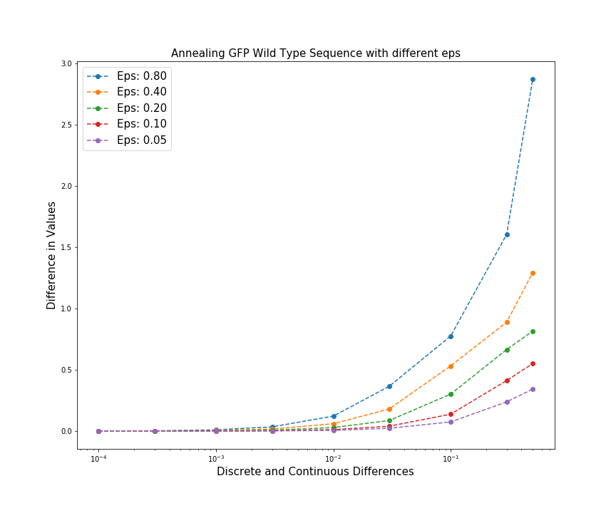

# Project Results 

## EDA

- y_max = 1.26

## Logs
### 10/5 (Base Model)
- Training Model: 
    ```python
    class MyModel(Model):
        def __init__(self):
            super(MyModel, self).__init__()
            self.d1 = Dense(500, name='d1')
            self.r1 = Activation('relu', name = 'r1')
            self.d2 = Dense(100, name='d2')
            self.r2 = Activation('relu', name = 'r1')
            self.d3 = Dense(1, name='d3')
    ```
    - Epochs: 30 
    - Learning Rate: 0.001
    - Test Loss: 0.04
- AM Output 1: 25.633339
    - Optimized result after maximizing the output with respect to the input
    - Input: Randomly distributed by a gaussian around 500 base pairs away from wild type 
    - Initial Output: 
    - Iterations: 100
    - Learning Rate: 1.0
    
- Annealing Results
    

### 10/13 (Base Model and Softmax Inputs)
- Training Model: 
    ```python
    class MyModel(Model):
        def __init__(self):
            super(MyModel, self).__init__()
            self.reshape = Reshape((-1, 714, 4), name = 'reshape')
            self.softmax = Softmax(axis=-1, name = 's1')
            self.flatten = Flatten()
            self.d1 = Dense(500, name='d1')
            self.r1 = Activation('relu', name = 'r1')
            self.d2 = Dense(100, name='d2')
            self.r2 = Activation('relu', name = 'r1')
            self.d3 = Dense(1, name='d3')
     ```
     - Epochs: 30
     - Learning Rate: 0.0003
     - Test Loss: 0.03
- Issues
    - We are trying to perform activation maximization on the simplex 
       which is the third layer of the neural network. 
        - We interpret the third layer as the probability at which each DNA base pair is either
        an 'A', 'C', 'T', or 'G'
        - This means that the one-hot encoded inputs which come in groups of four like 
          `[1, 0, 0, 0]` are passed through the softmax layer and evaluate to the point 
          `[0.475, 0.174, 0.174, 0.174]` in the simplex. 
          - This *probability* may not be reflective of the true distribution of the inputs
        - The inputs to the Neural Network can be within an arbitrary range of negative infinite to 
        positive infinite which may or may not be what we want.
        - There seems to be no other way to perform gradient ascent on the simplex 
            unless there a way to force the gradient to be resized so that its
            addition to the input is still part of the simplex?  
- AM Outputs
    - AM Output 1: 1.319
        - Iterations: 100
        - Input: Randomly distributed by a gaussian and around 500 base pairs away from wild type 
        - Learning Rate: 1.0    
        - Higher than y_max
    - AM Output 2: 0.811
        - 
        - Lower than y_max and wild type output of 0.9644
- Observation
    - my brudda
