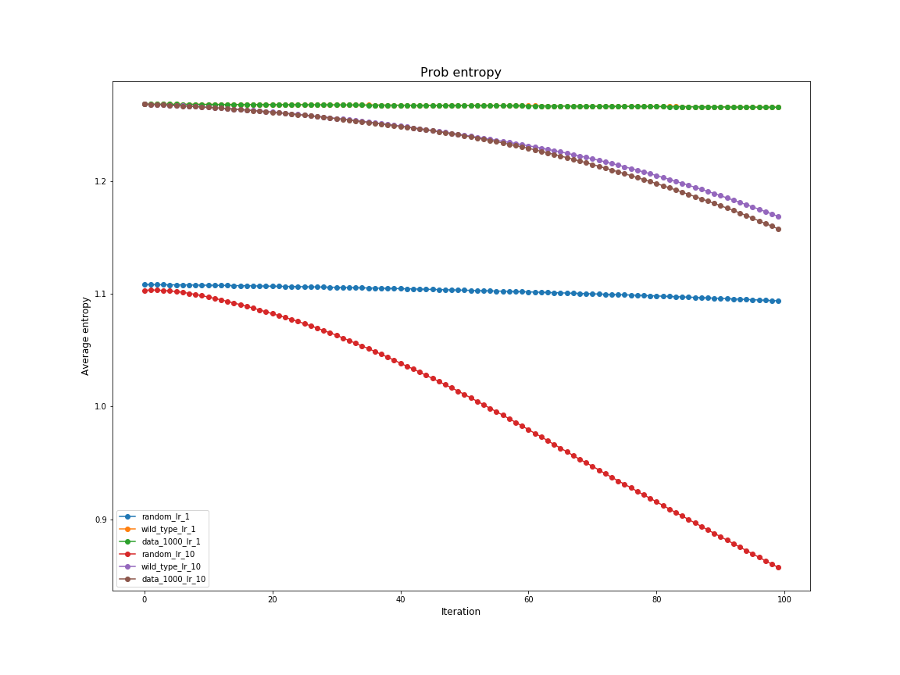
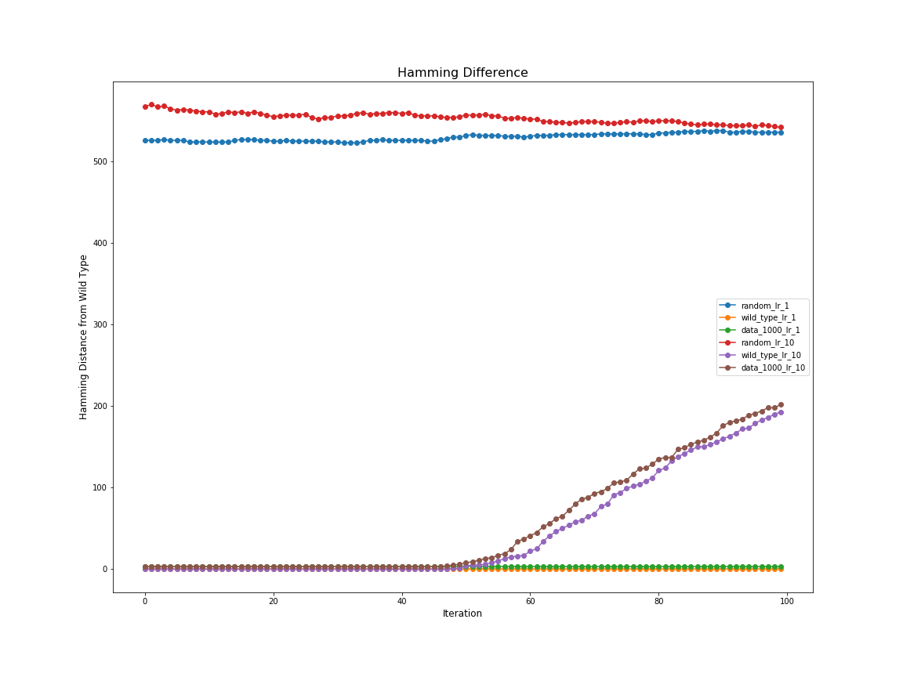
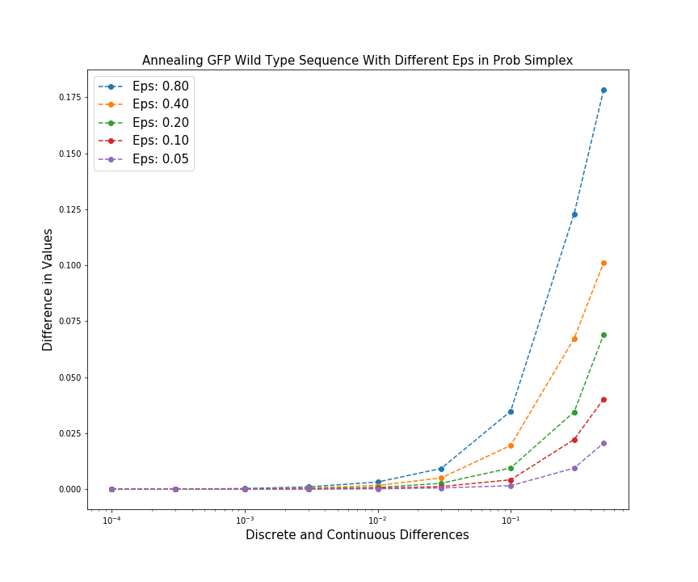

# Project Results 

## EDA

- y_max = 1.26

## Logs
### 10/5 (Base Model)
- Training Model: 
    ```python
    class MyModel(Model):
        def __init__(self):
            super(MyModel, self).__init__()
            self.d1 = Dense(500, name='d1')
            self.r1 = Activation('relu', name = 'r1')
            self.d2 = Dense(100, name='d2')
            self.r2 = Activation('relu', name = 'r1')
            self.d3 = Dense(1, name='d3')
    ```
    - Epochs: 30 
    - Learning Rate: 0.001
    - Test Loss: 0.04
- AM Output: 25.633339
    - Optimized result after maximizing the output with respect to the input
    - Input: Randomly distributed gaussian ~500 base pairs away from wild type 
    - Initial Output: 0.5
    - Iterations: 100
    - Learning Rate: 1.0
    
- Annealing Results
    
    - Difference can be up to 3.0   
 
### 10/13 (Base Model and Softmax Inputs)
- Training Model: 
    ```python
    class MyModel(Model):
        def __init__(self):
            super(MyModel, self).__init__()
            self.reshape = Reshape((-1, 714, 4), name = 'reshape')
            self.softmax = Softmax(axis=-1, name = 's1')
            self.flatten = Flatten()
            self.d1 = Dense(500, name='d1')
            self.r1 = Activation('relu', name = 'r1')
            self.d2 = Dense(100, name='d2')
            self.r2 = Activation('relu', name = 'r1')
            self.d3 = Dense(1, name='d3')
     ```
     - Epochs: 30
     - Learning Rate: 0.0003
     - Test Loss: 0.03
- Notes
    - We are trying to perform activation maximization on the simplex 
       which is the output of the third layer of the neural network. 
        - We interpret the third layer's output as the probability at which each DNA base pair is either
        an 'A', 'C', 'T', or 'G'
        - This means that the inputs which are one-hot encoded in groups of four like 
          `[1, 0, 0, 0]` are passed through the first three layers and evaluate to 
          `[0.475, 0.174, 0.174, 0.174]` on the simplex. 
          - This *point* may not be reflective of the true distribution of the DNA sequence.
        - The input values to the Neural Network can now be an arbitrary range from negative infinite to 
        positive infinite which may or may not be what we want.
        - There seems to be no other way to perform gradient ascent on the simplex 
            unless there is a way to force the gradient to be resized so that its
            addition to the input is still part of the simplex?  
- AM Output Results
    - 100 Iterations of gradient ascent with the derivative of the input taken with respect to the output
    - AM Output 1: 1.30012
        - Input: Randomly distributed gaussian around 500 base pairs away from wild type 
        - Initial Output: 0.77652
        - Learning Rate: 1.0  
    - AM Output 2: 0.81056
        - Input: Wild Type Sequence
        - Initial Output: 0.76100
        - Learning Rate: 1.0 
        - Note: these two values are less than the real y_train value which is around 0.9
    - AM Output 3: 0.81179
        - Input: Training Data Point 1000
        - Initial Output: 0.7622
        - Learning Rate: 1.0 
        - Note: these two values are less than the real y_train value which is around 0.9
    - AM Output 4: 2.792363
        - Input: Randomly distributed gaussian around 500 base pairs away from wild type 
        - Initial Output: 0.66415113
        - Leraning Rate: 10.0
     - AM Output 5: 1.52031
        - Input: Wild Type Sequence
        - Initial Output: 0.761007
        - Learning Rate: 10.0
     - AM Output 6: 1.61857
        - Input: Training Data Point 1000
        - Initial Output: 0.762267
        - Learning Rate: 10.0
- AM Output Plots
   - Losses: 
       
   - Entropy: 
       
   - Hamming Difference: 
                  
- AM Output Analysis: 
    - The function that we are optimizing has local optimums at the training points. However, it also has **higher** local optimums 
    at points in the search space **far away** from the training data
    - Increasing the learning rate allows the neural network to jump outside the local maximum of its training points
        - The hamming distances plot shows that if the learning rate is small, the sequence will just stay within a training data point
    - The average entropy of each group of 4 inputs decreases with each iteration meaning the distribution is becoming more pointed towards the boundaries of the simplex.  
- Annealing Results: 
    - 
        - Max Difference: **0.025**
        - Annealing one-hot encoded wild type as input to the first layer of the Neural Network 
        - This is changing the probability simplex from `[0.475, 0.174, 0.174, 0.174]` to `[0.31, 0.31, 0.18, 0.18]` when we use p = 0.5
    - 
        - Max Difference: **0.175**
        - Annealing  one-hot encoded wild type as input to the fourth layer of the Neural Network 
        - This is changing the probability simplex from `[1, 0, 0, 0]` to `[0.5, 0.5, 0, 0]` when we use p = 0.5
        - The difference is greater when we perturb on the fourth layer's input because we are changing the simplex by a greater amount 
    - The change is always positive because the when we anneal, the entropy always increases so the output goes down.
       - The discrete wild type input (groups of 4 like `[1, 0, 0, 0]`) achieves a value: 0.99044275.
       - The continuous training data input (groups of 4 like `[0.475, 0.174, 0.174, 0.174]`) achieves a value: 0.76100.
    - The model learned without applying softmax to the inputs can learn any arbitrary function for the simplex space and thus 
        is more prone to perturbations when evaluating the model on continuous simplex input. That is why in the continuous simplex, you can get a difference of up to 3.  
    - The model learned by applying softmax to the inputs sees training data points in the simplex layer such as `[0.475, 0.174, 0.174, 0.174]`. For some reason, it is 
        is also trying to maximize points that lie on the bondary of the simplex like `[1, 0, 0, 0]`. Therefore this model learns 
        a much smoother interpolation between discrete inputs and the continuous simplex.
    
## Next Steps: 
- Why is it that when we decrease entropy the loss function goes up? Or in other words, why does the model assign higher values to points closer to the 
  boundaries of the probability simplex?
    - Is it because we interpet the simplex layer as probabilities. Thus, if you are certain that you will see your
     training data (groups like `[1, 0, 0, 0]`) than the model yield higher outputs than if you only sort of think you will 
     you see your training data (groups like`[0.48, 0.17, 0.17, 0.17]`)?
- Why is the landscape of the model trained without applying softmax to the inputs have such higher optimums than the model trained by applying softmax to the input?
- Try annealing just one value, what does the function look like. Anneal from worse -> better and better -> worse. Is it linear?
- Run experiment with prior added to loss function to make the model assign low outputs to points far from the training data.
