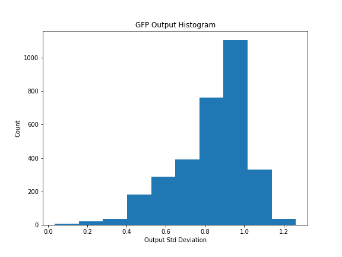
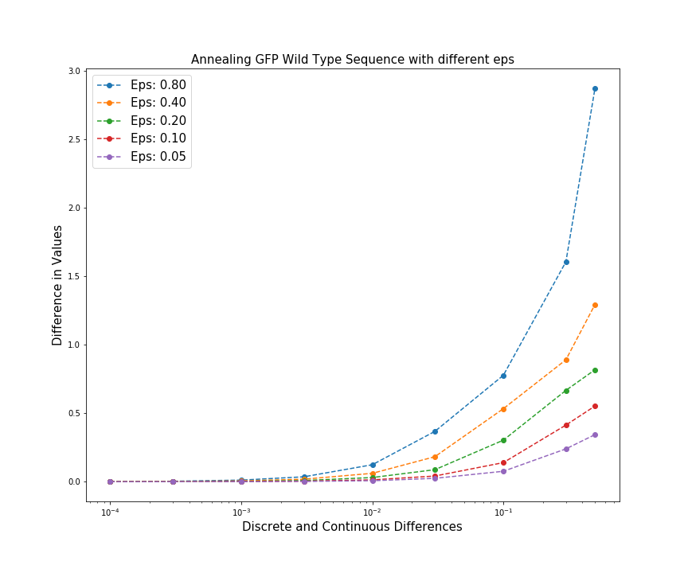

# Training Results 

## EDA

- y_max = 1.238

## Logs
### 10/5 (Base Model)

```python
class MyModel(Model):
    def __init__(self):
        super(MyModel, self).__init__()
        self.d1 = Dense(500, name='d1')
        self.r1 = Activation('relu', name = 'r1')
        self.d2 = Dense(100, name='d2')
        self.r2 = Activation('relu', name = 'r1')
        self.d3 = Dense(1, name='d3')

Epochs=30
Learning_Rate=0.001
```
- Test Loss: 0.04
- AM optimized outputs after 100 iterations on random gaussian input: 25.633339


### 10/13 (Base Model and Softmax Inputs)

```python
class MyModel(Model):
    def __init__(self):
        super(MyModel, self).__init__()
        self.reshape = Reshape((-1, 714, 4), name = 'reshape')
        self.softmax = Softmax(axis=-1, name = 's1')
        self.flatten = Flatten()
        self.d1 = Dense(500, name='d1')
        self.r1 = Activation('relu', name = 'r1')
        self.d2 = Dense(100, name='d2')
        self.r2 = Activation('relu', name = 'r1')
        self.d3 = Dense(1, name='d3')
        
 Epochs=30
 Learning_Rate=0.0003
 ```
- Test Loss: 0.03
- Not the most accurate but will have to do. 
    - the 0 and 1’s are just arbitrary values (one-hot encoded vs can be > 1000 in AM)
    - the middle layer is interpreted as probabilities. 
    - if we do it with real training data it converges there, else it goes into lala land
    - now the annealing experiment doesn’t make much sense anymore cause we assume that the am thing can just go to 0, 1 (we interpret this space as probability) when its trained its just some arbitrary value. anneal on the space anyways because its the one that’s actually annealed

     
